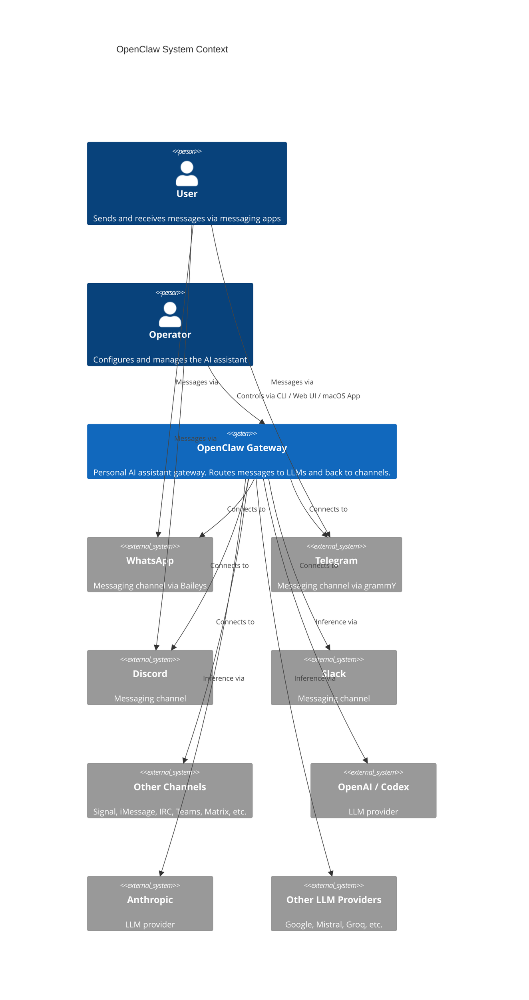
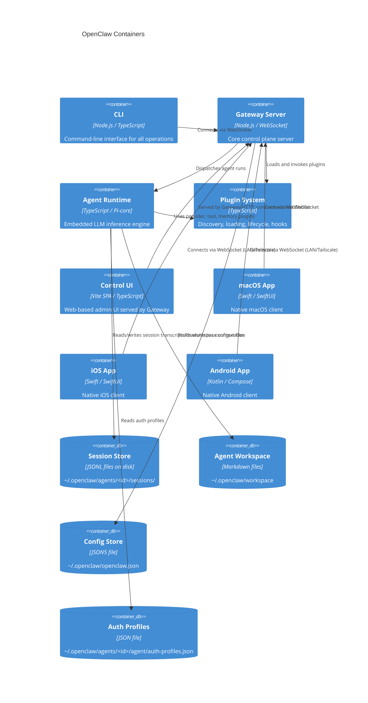
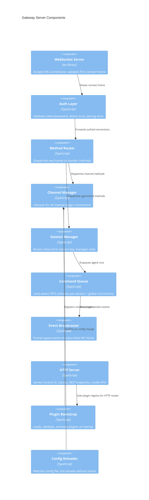
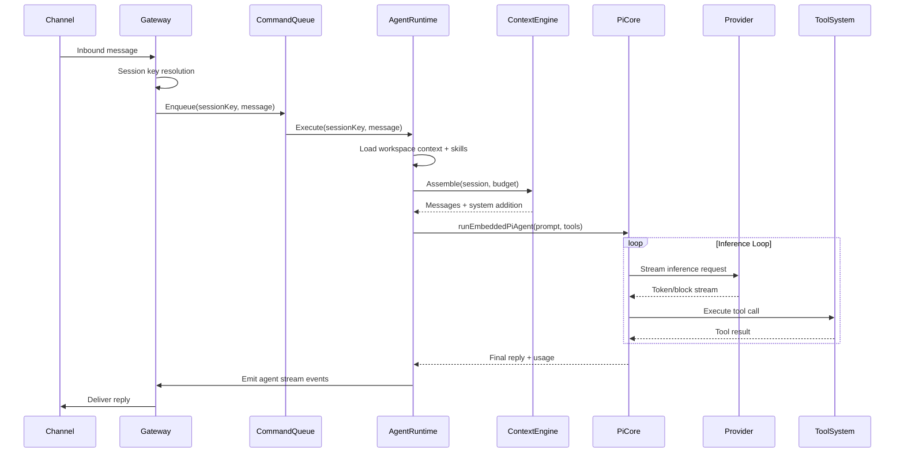
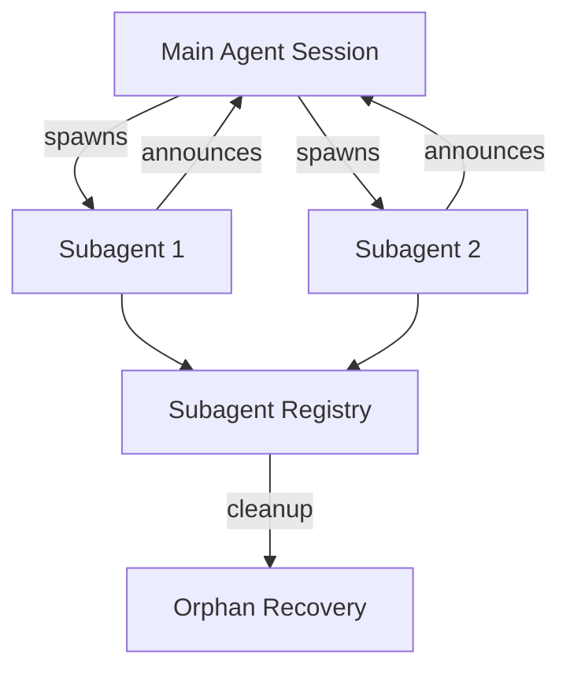
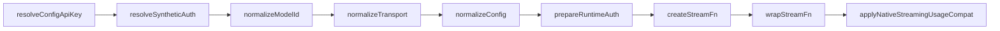
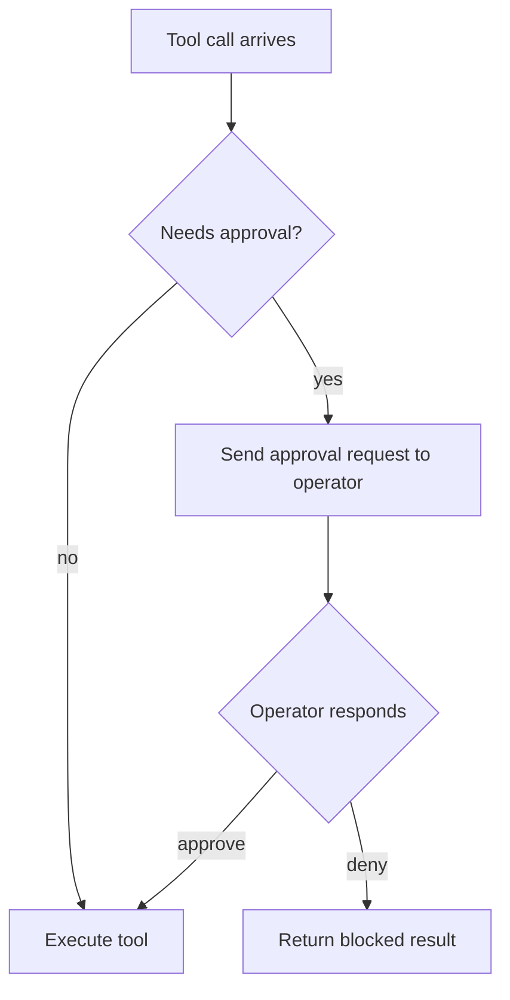
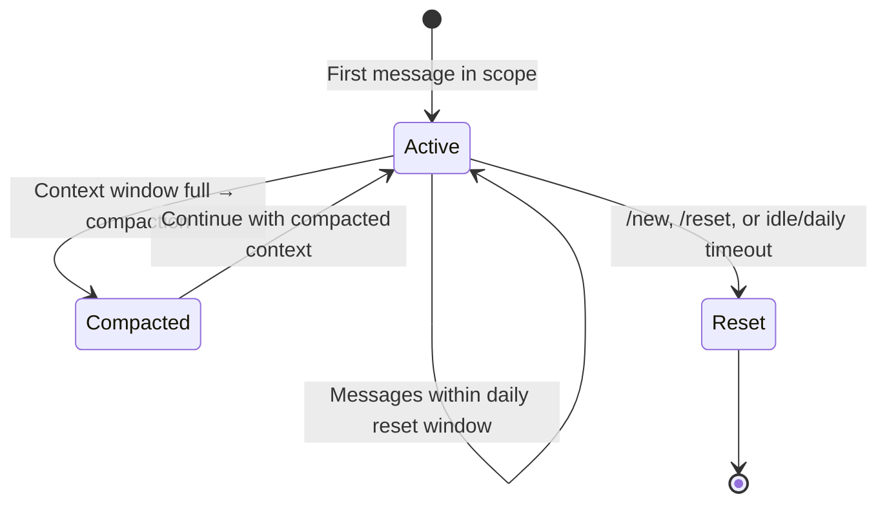
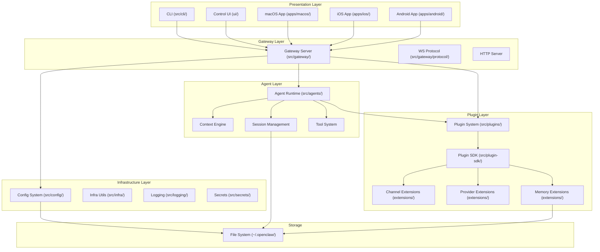

# OpenClaw Architecture Blueprint

**Generated:** 2026-04-20 21:11:06.895 UTC  
**Mode:** claude-sonnet-4.6  
**Project Type:** Node.js (TypeScript, ESM)  
**Architecture Pattern:** Plugin-first Event-Driven Gateway  
**Detail Level:** Detailed

---

## 1. Architecture Detection and Analysis

### Technology Stack

| Layer              | Technologies                             |
| ------------------ | ---------------------------------------- |
| Runtime            | Node.js 22+/24, Bun                      |
| Language           | TypeScript (strict, ESM)                 |
| Package Manager    | pnpm (workspace), Bun (dev tooling)      |
| Build              | tsdown, tsgo (custom TS checker), Vitest |
| Gateway Transport  | WebSocket (ws), HTTP                     |
| Schema Validation  | TypeBox, Zod                             |
| Linting/Formatting | Oxlint, Oxfmt                            |
| Mobile (iOS)       | Swift, SwiftUI (Observation framework)   |
| Mobile (Android)   | Kotlin, Jetpack Compose                  |
| Desktop (macOS)    | Swift, SwiftUI                           |
| Web UI             | Vite + TypeScript SPA                    |

### Architecture Pattern Detection

OpenClaw follows a **Plugin-first Event-Driven Gateway** architecture with these dominant patterns:

- **Gateway Pattern**: Single long-lived server owns all messaging surfaces and client connections
- **Plugin Architecture**: Capabilities (channels, providers, memory, tools) registered through a typed manifest/SDK contract
- **Command Queue Pattern**: Serialized agent run lanes prevent tool and session races
- **Hexagonal Architecture**: Core is extension-agnostic; plugins cross the boundary only via `openclaw/plugin-sdk/*`
- **Event-Driven Messaging**: WebSocket typed events, pub/sub for streaming, lifecycle hooks

---

## 2. Architectural Overview

OpenClaw is a **personal AI gateway** that:

1. Exposes a single control plane (Gateway) over WebSocket
2. Connects to multiple messaging channels (WhatsApp, Telegram, Slack, Discord, etc.)
3. Routes inbound messages through a serialized command queue to an embedded agent runtime
4. Executes an LLM inference loop with tool support
5. Delivers responses back through the originating channel

### Guiding Principles

1. **Local-first**: Gateway runs on user's own devices; all data stays local
2. **Extension-agnostic core**: Core never special-cases specific plugins/channels
3. **Manifest-driven discovery**: Plugin capabilities are declared in `openclaw.plugin.json`, not hard-coded
4. **Prompt-cache stability**: Deterministic ordering for model payloads preserves cache efficiency
5. **Security by default**: DM pairing, device trust, allowlists, SSRF protection built-in

### Architectural Boundaries

```
┌─────────────────────────────────────────────────┐
│  Clients: macOS app / iOS / Android / Web UI    │
│           CLI / Headless nodes                  │
└─────────────┬───────────────────────────────────┘
              │ WebSocket (typed protocol)
┌─────────────▼───────────────────────────────────┐
│  Gateway (Control Plane)                        │
│  - Auth / Pairing / Device trust                │
│  - Channel management                           │
│  - Session routing                              │
│  - HTTP server (Control UI, Canvas, MCP)        │
└──┬────────────────────────┬─────────────────────┘
   │ Plugin SDK             │ Command Queue
   │                        │
┌──▼─────────────┐  ┌───────▼───────────────────┐
│ Plugin System  │  │  Agent Runtime (Pi Core)   │
│ - Channels     │  │  - Context Assembly        │
│ - Providers    │  │  - Model Inference         │
│ - Tools        │  │  - Tool Execution          │
│ - Memory       │  │  - Session Management      │
│ - Skills       │  │  - Subagent Registry       │
└────────────────┘  └───────────────────────────┘
```

---

## 3. Architecture Visualization (C4 Diagrams)

### Level 1: System Context



### Level 2: Container Diagram



### Level 3: Component Diagram — Gateway Core



### Level 4: Agent Runtime Sequence



---

## 4. Core Architectural Components

### 4.1 Gateway Server (`src/gateway/`)

**Purpose:** Single long-lived control plane that owns all messaging surfaces.

**Responsibilities:**

- WebSocket connection lifecycle (auth, handshake, heartbeat)
- HTTP server (Control UI, Canvas, MCP, OpenAI-compat endpoints)
- Channel plugin management (connect, reconnect, health monitor)
- Session routing and the command queue
- Config hot-reload without process restart
- Device pairing store (trust model)
- CRON scheduling

**Key files:**

- `server.ts` — main gateway server composition
- `server-startup.ts` — ordered startup phases
- `server-channels.ts` — channel plugin lifecycle
- `server-http.ts` — HTTP server setup
- `auth.ts` / `auth-mode-policy.ts` — authentication modes
- `device-auth.ts` — device trust and pairing
- `server-cron.ts` — scheduled tasks

**Internal structure:**

```
src/gateway/
├── server.ts                    # Top-level gateway composition
├── server-startup.ts            # Ordered startup phases
├── server-http.ts               # HTTP server
├── server-channels.ts           # Channel lifecycle
├── server-chat.ts               # Chat/agent message handling
├── protocol/                    # TypeBox-typed WS protocol
│   └── schema.ts / schema/*.ts  # Gateway protocol schemas
├── server-methods/              # Individual RPC method handlers
├── auth*.ts                     # Authentication surfaces
├── device-auth.ts               # Device trust / pairing
└── hooks*.ts                    # Hook runner integration
```

**Extension points:**

- Plugin hooks: `gateway_start`, `gateway_stop`, `message_received`, `message_sending`, `message_sent`
- Config hot-reload via `config-reload.ts`
- HTTP route registration via plugin registry

---

### 4.2 Agent Runtime (`src/agents/`)

**Purpose:** Embedded LLM inference engine, wrapping the Pi-agent-core library.

**Responsibilities:**

- Serialized agent runs per session key (per-session lane + global lane)
- Workspace and bootstrap context file loading
- Skills loading and snapshot management
- System prompt assembly
- Model and auth profile resolution
- Tool execution and policy enforcement
- Subagent spawning and registry
- Session transcript persistence

**Key files:**

- `pi-embedded-runner.ts` — primary agent runner
- `pi-embedded-subscribe.ts` — bridges Pi events to Gateway streams
- `agent-command.ts` — RPC entry point for `agent` method
- `system-prompt.ts` — system prompt assembly
- `compaction.ts` — context compaction
- `subagent-registry.ts` — subagent lifecycle tracking
- `skills.ts` — skill loading and snapshot

**Subagent Architecture:**



**Extension points:**

- Plugin hooks: `before_model_resolve`, `before_prompt_build`, `before_agent_start`, `before_agent_reply`, `agent_end`, `before_compaction`, `after_compaction`, `before_tool_call`, `after_tool_call`, `tool_result_persist`, `session_start`, `session_end`
- Context engine slot (pluggable): `plugins.slots.contextEngine`
- Skills from multiple directories (layered)

---

### 4.3 Plugin System (`src/plugins/`)

**Purpose:** Discovery, validation, loading, lifecycle, and capability registry for all plugins.

**Responsibilities:**

- Scanning bundled and installed plugin directories
- Manifest validation (`openclaw.plugin.json`)
- Plugin loading via jiti (TS-aware dynamic imports)
- Capability registration (channels, providers, tools, memory, context engine)
- Hook runner integration
- Plugin auto-enable based on detected auth/env
- CLI for install/uninstall/update from npm or ClaWHub

**Key files:**

- `loader.ts` — plugin loading and jiti cache
- `manifest.ts` / `manifest-registry.ts` — manifest parsing and registry
- `registry.ts` — plugin capability registry
- `hooks.ts` — plugin hook runner
- `install.ts` / `installs.ts` — installation management
- `bundled-dir.ts` — bundled plugin scanning
- `provider-runtime.ts` — provider plugin runtime

**Plugin manifest structure (`openclaw.plugin.json`):**

```json5
{
  id: "my-plugin",
  name: "My Plugin",
  version: "1.0.0",
  "openclaw.install.npmSpec": "@scope/my-plugin",
  "openclaw.channel.id": "my-channel", // for channel plugins
  "openclaw.provider.id": "my-provider", // for provider plugins
  capabilities: ["text-inference", "speech"],
}
```

**Plugin types:**

- **Channel plugins**: messaging surface adapters (WhatsApp, Telegram, etc.)
- **Provider plugins**: LLM/AI provider adapters (OpenAI, Anthropic, etc.)
- **Tool plugins**: additional agent tools
- **Memory plugins**: alternative memory backends
- **Context engine plugins**: alternative context assembly strategies

---

### 4.4 Channel System (`src/channels/`)

**Purpose:** Core channel implementation primitives; plugins provide messaging adapters.

**Responsibilities:**

- Account resolution and normalization
- Allowlist and DM policy enforcement
- Reply pipeline (outbound delivery)
- Typing indicators lifecycle
- Thread bindings (group/DM routing)
- Channel config schema validation
- Pairing and security adapters

**Key files:**

- `registry.ts` — channel plugin registry
- `channel-policy.ts` — DM and allowlist policy
- `channel-reply-pipeline.ts` — outbound delivery
- `channel-pairing.ts` — pairing flow
- `channel-streaming.ts` — block streaming delivery
- `plugins/types.plugin.ts` — channel plugin interface

**Channel plugin interface (key adapters):**

```typescript
// From src/channels/plugins/types.plugin.ts
interface ChannelPlugin {
  id: string;
  messaging: ChannelMessagingAdapter; // poll/receive
  outbound: ChannelOutboundAdapter; // send replies
  pairing: ChannelPairingAdapter; // trust model
  security: ChannelSecurityAdapter; // allowlist/DM policy
  threading?: ChannelThreadingAdapter; // thread/group routing
  config: ChannelConfigSchema; // JSON schema for channel config
}
```

**Bundled channel extensions** (`extensions/`):
`discord`, `telegram`, `slack`, `whatsapp`, `signal`, `imessage`, `bluebubbles`, `matrix`, `msteams`, `googlechat`, `feishu`, `irc`, `line`, `mattermost`, `nextcloud-talk`, `nostr`, `synology-chat`, `tlon`, `twitch`, `zalo`, `zalouser`, and more.

---

### 4.5 Provider System (`src/plugin-sdk/provider-*.ts`, `src/agents/`)

**Purpose:** LLM/AI provider runtime adapters registered through the Plugin SDK.

**Responsibilities:**

- Model catalog registration
- Auth profile resolution (API key, OAuth, env vars)
- Model ID normalization
- Transport selection (REST, WebSocket, Anthropic vertex, etc.)
- Streaming response parsing
- Usage tracking
- Tool schema normalization per provider
- Model failover and auth rotation

**Provider hook lifecycle:**



**Auth profile rotation:**

```
auth-profiles.json
  └─ profiles[] (ordered by priority/lastUsed)
       ├─ profile-A (api-key)
       ├─ profile-B (oauth)
       └─ profile-C (env-var synthetic)
```

**Bundled provider extensions:**
`anthropic`, `openai`, `google`, `amazon-bedrock`, `mistral`, `groq`, `deepseek`, `xai`, `ollama`, `lmstudio`, `github-copilot`, `openrouter`, `litellm`, `opencode`, `codex`, and ~40 more.

---

### 4.6 Tool System (`src/agents/pi-tools.ts`, `src/agents/tools/`)

**Purpose:** Agent tool registration, policy enforcement, and execution.

**Built-in tools:**

- File: `read`, `write`, `edit`, `list`, `glob`
- Exec: `bash`, `apply_patch`
- Memory: `memory_get`, `memory_search`
- Agent: `agent` (subagent spawn), `sessions_list`, `sessions_history`
- Media: `image_generate`, `video_generate`, `music_generate`
- Web: `web_search`, `web_fetch`
- Canvas: `canvas_*`
- Nodes: `camera_*`, `location_get`, `screen_record`

**Tool policy pipeline:**

```
Inbound tool call
  → before_tool_call hooks (can block)
  → policy pipeline (allowlist/denylist/exec-approval)
  → sandbox path enforcement
  → tool execution
  → tool_result_persist hook
  → after_tool_call hooks
```

**Exec approval flow:**



---

### 4.7 Memory System (`extensions/memory-core/`, `extensions/active-memory/`)

**Purpose:** Persistent memory across sessions using workspace Markdown files and optional vector search.

**Memory file layout:**

```
~/.openclaw/workspace/
├── MEMORY.md              # Long-term durable facts (loaded every session)
├── memory/
│   ├── 2026-04-20.md      # Today's daily notes (loaded automatically)
│   └── 2026-04-19.md      # Yesterday's notes (loaded automatically)
├── DREAMS.md              # Dream diary / sweep summaries
└── AGENTS.md              # Operating instructions
```

**Memory backends:**

- `memory-core`: default, file-based markdown memory + hybrid search (vector + keyword)
- `memory-lancedb`: LanceDB vector store backend
- `memory-wiki`: knowledge wiki with provenance tracking

**Memory search flow:**

```
memory_search(query)
  → embedding provider (OpenAI/Gemini/Voyage/Mistral)
  → vector similarity search (LanceDB or in-memory)
  + keyword search
  → ranked results
```

**Active memory** (`extensions/active-memory/`): background sweep that auto-consolidates daily notes into durable memory.

---

### 4.8 Session Management (`src/gateway/session-*.ts`)

**Purpose:** Route and isolate conversation sessions by scope.

**Session key scoping:**

```
DM scope modes:
  main                    → all DMs share one session
  per-peer                → isolate by sender
  per-channel-peer        → isolate by channel + sender
  per-account-channel-peer → isolate by account + channel + sender
```

**Session storage:**

```
~/.openclaw/agents/<agentId>/
├── sessions/
│   ├── sessions.json          # Session metadata store
│   └── <sessionId>.jsonl      # Session transcripts (one event per line)
```

**Session lifecycle:**



---

### 4.9 Context Engine (`src/agents/context*.ts`)

**Purpose:** Assemble model context for each inference run, managing token budget and history.

**Lifecycle hooks:**

1. **Ingest** — index new message in engine's store
2. **Assemble** — build ordered message list fitting token budget
3. **Compact** — summarize older history to free token space
4. **After turn** — persist state, trigger background work

**Default (legacy) engine behavior:**

- Loads session transcript from JSONL
- Applies history limits (DM scope, per-session turn limits)
- Compacts when context exceeds budget (Anthropic-style summarize-then-continue)
- Respects `agents.defaults.historyLimit` and model-specific context windows

**Pluggable engine:**

```json5
// openclaw.json
{
  plugins: {
    slots: { contextEngine: "my-context-engine" },
  },
}
```

---

### 4.10 Multi-Agent Routing (`src/agents/`, `src/config/bindings.ts`)

**Purpose:** Multiple isolated agents (separate workspace, auth, sessions) in one gateway process.

**Agent isolation:**

```
~/.openclaw/
├── agents/
│   ├── main/
│   │   ├── agent/auth-profiles.json
│   │   └── sessions/
│   ├── coding/
│   │   ├── agent/auth-profiles.json
│   │   └── sessions/
│   └── social/
│       ├── agent/auth-profiles.json
│       └── sessions/
├── workspace/          # main agent workspace
├── workspace-coding/   # coding agent workspace
└── workspace-social/   # social agent workspace
```

**Binding configuration:**

```json5
{
  agents: {
    list: [{ id: "coding", workspace: "~/.openclaw/workspace-coding" }],
  },
  bindings: [{ channel: "discord", account: "coding-bot", agentId: "coding" }],
}
```

---

## 5. Architectural Layers and Dependencies



**Dependency rules:**

- Presentation → Gateway only (WebSocket protocol)
- Gateway → Agent Runtime, Plugin System, Config
- Agent Runtime → Plugin System (via SDK), Config, Storage
- Extensions → Plugin SDK only (never `src/**` directly)
- Plugin SDK → stable typed contracts (no implementation details)

---

## 6. Data Architecture

### Configuration Data Model

```typescript
// Simplified from src/config/types.openclaw.ts
interface OpenClawConfig {
  agent: {
    workspace: string;
    skipBootstrap?: boolean;
  };
  agents: {
    defaults: AgentDefaults; // model, tools, skills, sandbox, etc.
    list: AgentEntry[]; // named agents
  };
  gateway: {
    port: number;
    bind: string;
    auth: GatewayAuth;
  };
  channels: {
    [channelId: string]: ChannelConfig;
  };
  models: {
    providers: Record<string, ModelProviderConfig>;
  };
  plugins: {
    entries: Record<string, PluginConfig>;
    slots: { contextEngine?: string };
  };
  session: SessionConfig;
  tools: ToolsConfig;
  hooks: HooksConfig;
}
```

### Session Transcript Format (JSONL)

```jsonl
{"type":"message","role":"user","content":"Hello","timestamp":"..."}
{"type":"message","role":"assistant","content":"Hi there!","timestamp":"..."}
{"type":"tool_call","name":"bash","input":{"command":"ls"},"timestamp":"..."}
{"type":"tool_result","name":"bash","output":"file.txt","timestamp":"..."}
```

### Auth Profile Store

```json
{
  "profiles": [
    {
      "id": "profile-1",
      "provider": "anthropic",
      "type": "api-key",
      "key": "<encrypted-or-plain>",
      "lastUsed": "2026-04-20T00:00:00Z",
      "lastGood": "2026-04-20T00:00:00Z"
    }
  ]
}
```

### Model Reference Format

```
provider/model-id
Examples:
  openai/gpt-5.4
  anthropic/claude-sonnet-4-6
  google/gemini-2.0-flash
  codex/gpt-5.4           ← Codex-owned harness
  opencode/claude-opus-4-6 ← OpenCode transport
```

---

## 7. Cross-Cutting Concerns Implementation

### 7.1 Authentication & Authorization

**Gateway auth modes** (`gateway.auth.mode`):

- `"shared-secret"` (default): token/password in `connect.params.auth`
- `"trusted-proxy"`: identity from request headers (Tailscale Serve)
- `"none"`: disabled (private ingress only)

**Device trust model:**

```
New device → pairing flow → device token → subsequent connects use token
Loopback → auto-approved
Non-local → always requires explicit approval
```

**Channel security:**

- DM pairing: unknown senders get a code; approved via `openclaw pairing approve`
- Allowlist: `channels.*.allowFrom` / `channels.*.dmPolicy`
- Security audit: `openclaw security audit`

### 7.2 Error Handling & Resilience

**Model failover:**

```
Primary model → try auth profile A → try auth profile B → cooldown
                                    ↓
Fallback model 1 → try auth profile C → ...
Fallback model 2 → ...
```

**Gateway resilience:**

- Auto-reconnect for channel plugins
- Channel health monitor (`channel-health-monitor.ts`) with policy-based restart
- Config hot-reload without restart
- Respawn support (`entry.respawn.ts`) for process-level recovery

**Tool execution:**

- Exec approval gates for shell commands
- Sandbox path enforcement
- SSRF dispatcher (`ssrf-dispatcher.ts`) for outbound fetch

### 7.3 Logging & Monitoring

**Logging stack:**

- Core logger: `src/logger.ts` (leveled, structured)
- Channel logging: `src/channels/logging.ts`
- WS logging: `src/gateway/ws-log.ts`
- Diagnostics: `extensions/diagnostics-otel/` (OpenTelemetry export)

**Log levels:** trace, debug, info, warn, error (configurable per subsystem via `logging.*`)

### 7.4 Validation

**External boundaries use TypeBox + Zod:**

- Config schema: `src/config/schema.ts` (TypeBox)
- Plugin manifest: `src/plugins/manifest.ts` (TypeBox)
- Gateway protocol: `src/gateway/protocol/schema.ts` (TypeBox + JSON Schema codegen)
- Channel configs: per-plugin Zod schemas

### 7.5 Configuration Management

**Config layering:**

```
~/.openclaw/openclaw.json     # primary config
OPENCLAW_CONFIG_PATH          # override path env var
OPENCLAW_PROFILE              # profile suffix
env vars (OPENCLAW_*)         # emergency overrides
```

**Config hot-reload:** Gateway watches config file; on change runs `config-reload-plan.ts` to determine which subsystems need restart (channels, model registry, etc.).

**Secret management:**

- `SecretRef`: `{ "$secret": "env:MY_VAR" }` or `{ "$secret": "file:path" }`
- Resolved at runtime; never written plaintext to logs
- `openclaw secrets` CLI for management

---

## 8. Service Communication Patterns

### WebSocket Protocol

**Frame types:**

```typescript
// Requests (client → server)
{ type: "req", id: string, method: string, params: unknown }

// Responses (server → client)
{ type: "res", id: string, ok: boolean, payload?: unknown, error?: GatewayError }

// Events (server → client, push)
{ type: "event", event: string, payload: unknown, seq?: number, stateVersion?: number }
```

**Key methods:**

- `connect` — mandatory handshake (device identity, auth token, challenge signature)
- `agent` — run agent with a message (returns runId immediately, streams events)
- `agent.wait` — wait for agent run completion by runId
- `send` — send message to channel
- `health` — gateway health check
- `status` — channel status
- `sessions.*` — session management

**Streaming events for agent runs:**

```
event:agent { stream: "assistant", delta: "...", runId }
event:agent { stream: "tool", name: "bash", status: "start", runId }
event:agent { stream: "lifecycle", phase: "end", runId, summary }
```

### MCP (Model Context Protocol)

**Exposed at:** `/_mcp/` HTTP endpoint

- Allows external MCP clients to use OpenClaw as a tool server
- Supports stdio and HTTP transports

**Consumed:** Agent can load external MCP tool servers via `mcp` config

```json5
{
  mcp: {
    servers: {
      "my-server": { command: "npx", args: ["@my/mcp-server"] },
    },
  },
}
```

### OpenAI-Compatible HTTP API

**Exposed at:** `/openai/v1/` and `/openresponses/` endpoints  
Allows tools like Cursor or Claude Desktop to point to OpenClaw as a local proxy.

---

## 9. Node.js-Specific Architectural Patterns

### ESM Module Boundaries

```
src/              → core production code (strict import boundaries)
src/plugin-sdk/   → public SDK subpaths (openclaw/plugin-sdk/*)
extensions/       → bundled plugins (only import via plugin-sdk/*)
packages/         → shared library packages (@openclaw/*)
```

**Import boundary enforcement (scripts/check-\*.mjs):**

- `check-extension-plugin-sdk-boundary.mjs` — extensions must not import `src/**` directly
- `check-src-extension-import-boundary.mjs` — core must not import extension internals
- `check-import-cycles.ts` — no circular dependencies
- `check-dynamic-import-warts.mjs` — no mixed static/dynamic imports for same module

### Dynamic Import Pattern

**Rule:** Never mix `await import("x")` and `import ... from "x"` for the same module in production paths. Use `*.runtime.ts` boundaries:

```typescript
// lazy-value.ts — exported, lazy boundary
export async function getHeavyModule() {
  return import("./heavy.runtime.js");
}

// heavy.runtime.ts — only dynamically imported
import { bigLib } from "big-lib";
export function doWork() { ... }
```

### Jiti Loader

Plugin code is loaded via **jiti** (TS-aware dynamic require/import), allowing bundled plugins to be TypeScript files executed at runtime without pre-compilation. The loader caches module graphs (`jiti-loader-cache.ts`).

---

## 10. Implementation Patterns

### Plugin Registration Pattern

```typescript
// Extension entry point (extensions/my-plugin/src/index.ts)
import type { OpenClawPluginApi } from "openclaw/plugin-sdk";

export default function myPlugin(api: OpenClawPluginApi) {
  // Register a channel
  api.registerChannel({ id: "my-channel", ... });

  // Register a provider
  api.registerProvider({ id: "my-provider", catalog: [...], ... });

  // Register a tool
  api.registerTool({ name: "my_tool", ... });

  // Register a hook
  api.on("before_tool_call", async (ctx) => { ... });
}
```

### Channel Plugin Pattern

```typescript
// Implements ChannelPlugin from src/channels/plugins/types.plugin.ts
export const myChannelPlugin: ChannelPlugin = {
  id: "my-channel",
  messaging: {
    poll: async (config) => { /* return ChannelPollResult[] */ },
    formatInbound: (msg) => { /* normalize to internal format */ },
  },
  outbound: {
    send: async (target, reply) => { /* deliver message */ },
    formatOutbound: (reply) => { /* format for channel */ },
  },
  pairing: buildAccountScopedDmSecurityPolicy(...),
  security: { ... },
  config: emptyChannelConfigSchema,
};
```

### Provider Plugin Pattern

```typescript
// Implements provider hooks from src/plugin-sdk/provider-entry.ts
export default function myProvider(api: OpenClawPluginApi) {
  api.registerProvider({
    id: "my-provider",
    catalog: async (ctx) => ({
      models: [{ id: "my-model", name: "My Model", contextWindow: 128000 }],
    }),
    createStreamFn: async (ctx) => {
      // return a stream function that calls the provider API
    },
    normalizeModelId: (id) => id.toLowerCase(),
    capabilities: { family: "openai-compat" },
  });
}
```

### Hook Pattern

```typescript
// Plugin hooks (src/agents/pi-hooks/)
api.on("before_tool_call", async (ctx) => {
  if (ctx.tool.name === "bash" && ctx.tool.input.command.includes("rm -rf")) {
    return { block: true, reason: "Dangerous command blocked" };
  }
});

api.on("before_prompt_build", async (ctx) => {
  return {
    prependContext: "Current date: " + new Date().toISOString(),
    appendSystemContext: "Always respond in markdown.",
  };
});
```

### Result Type Pattern

```typescript
// Used throughout for recoverable runtime decisions
type Result<T, E> = { ok: true; value: T } | { ok: false; error: E };

// Error code unions (closed)
type ToolPolicyResult =
  | { action: "allow" }
  | { action: "block"; reason: string }
  | { action: "require-approval"; approvalId: string };
```

### Config Schema Pattern

```typescript
// TypeBox schema with help text (src/config/schema.ts pattern)
const MyChannelConfig = Type.Object({
  token: Type.Optional(Type.String({ description: "Bot token" })),
  dmPolicy: Type.Optional(
    Type.Union([Type.Literal("pairing"), Type.Literal("open")]),
  ),
});
```

---

## 11. Testing Architecture

### Test Framework

```
Vitest (test runner) + V8 coverage
├── Unit tests:          src/**/*.test.ts
├── Integration tests:   src/**/*.integration.test.ts
├── E2E tests:           src/**/*.e2e.test.ts
└── Live tests:          src/**/*.live.test.ts (require OPENCLAW_LIVE_TEST=1)
```

### Test Pool Architecture

```
threads pool (default):
  - Most unit/integration tests

forks pool (exceptions):
  - src/gateway/ tests (process isolation needed)
  - src/agents/ tests (heavy module graph)
  - src/commands/ tests (CLI execution)
```

**Pool control:**

```bash
# Conservative memory
OPENCLAW_VITEST_MAX_WORKERS=1 pnpm test

# Full fork pool for debugging
OPENCLAW_VITEST_POOL=forks pnpm test
```

### Test Boundary Rules

- Extension tests stay in the owning extension package
- Core tests use `src/test-utils/bundled-plugin-public-surface.ts` to access plugin APIs
- Shared test helpers in `test/helpers/` use public SDK surfaces only
- Per-instance stubs preferred over prototype mutation

### Performance Guardrails

```typescript
// GOOD: static import once, reset state per test
import { myModule } from "./my-module.js";
beforeEach(() => {
  vi.clearAllMocks();
});

// BAD: module graph reload per test
beforeEach(async () => {
  vi.resetModules();
  const { myModule } = await import("./my-module.js"); // expensive!
});
```

---

## 12. Deployment Architecture

### Local Deployment (primary)

```
macOS:
  Gateway → launchd service (ai.openclaw.gateway)
  CLI → openclaw CLI binary
  App → openclaw-mac native app

Linux/Windows WSL:
  Gateway → systemd user service
  CLI → openclaw CLI binary
```

### Gateway Modes

```
Foreground:  openclaw gateway --port 18789 --verbose
Daemon:      openclaw gateway start (installs as launchd/systemd)
Docker:      docker run openclaw/openclaw
Fly.io:      fly.toml configuration
K8s:         scripts/k8s/ manifests
```

### Remote Access Patterns

```
Tailscale (preferred):
  gateway.bind = "tailscale"
  Clients connect to Tailscale IP directly

SSH tunnel:
  ssh -N -L 18789:127.0.0.1:18789 user@host

VPN/Cloudflare Tunnel:
  Similar to SSH tunnel pattern
```

### Node Architecture (Mobile)

```
Mobile Node (iOS/Android)
  → WS connect with role: "node"
  → Declares capabilities: canvas.*, camera.*, location, screen.record
  → Commands invoked by gateway on behalf of agent
  → Device pairing required (explicit approval)
```

---

## 13. Extension and Evolution Patterns

### Adding a New Channel Plugin

1. Create `extensions/my-channel/` with:
   - `package.json` (name: `@openclaw/my-channel-plugin`)
   - `openclaw.plugin.json` (id, channel.id, capabilities)
   - `src/index.ts` (exports `ChannelPlugin` implementation)
   - `src/api.ts` (public surface for core tests to use)

2. Implement `ChannelPlugin` interface from `openclaw/plugin-sdk/channel-contract`

3. Register in plugin discovery (auto-detected from bundled dir)

4. Update `.github/labeler.yml` with new channel label

5. Add documentation in `docs/channels/`

### Adding a New LLM Provider Plugin

1. Create `extensions/my-provider/` with manifest and entry

2. Implement provider hooks via `api.registerProvider({...})`

3. Declare `providerAuthEnvVars` in manifest for env-based auto-detection

4. Add auth methods (API key, OAuth) in provider's `auth[]` config

5. Update `docs/providers/` and `docs/concepts/model-providers.md`

### Adding a New Tool

1. Via plugin: `api.registerTool({ name: "my_tool", description, schema, handler })`
2. Add to tool policy allowlist if needed
3. Document in `docs/tools/`

### Modifying the Gateway Protocol

Protocol changes are **contract changes**. Process:

1. Update TypeBox schema in `src/gateway/protocol/schema.ts`
2. Regenerate JSON Schema: `pnpm run protocol-gen`
3. Regenerate Swift models: `pnpm run protocol-gen-swift`
4. Update docs in `docs/gateway/protocol.md`
5. Version the change if breaking

---

## 14. Architectural Pattern Examples

### Layer Separation: Plugin SDK Boundary

```typescript
// ✅ CORRECT: Extension imports from plugin-sdk
import type { OpenClawPluginApi } from "openclaw/plugin-sdk";
import { buildChatChannelMetaById } from "openclaw/plugin-sdk/core";

// ❌ WRONG: Extension reaches into core src
import { someHelper } from "../../src/channels/internal-helpers.js";
```

### Extension Point: Context Engine Plugin

```typescript
// extensions/my-context-engine/src/index.ts
import type { OpenClawPluginApi, ContextEnginePlugin } from "openclaw/plugin-sdk";

const engine: ContextEnginePlugin = {
  id: "my-context-engine",

  async ingest(message, session) {
    // Index the message
  },

  async assemble(session, budget) {
    // Return messages that fit in budget
    return { messages: [...], systemPromptAddition: "..." };
  },

  async compact(session) {
    // Summarize old messages
  },

  async afterTurn(session, result) {
    // Persist state
  },
};

export default function plugin(api: OpenClawPluginApi) {
  api.registerContextEngine(engine);
}
```

### Command Queue: Lane-Aware Serialization

```typescript
// src/agents/lanes.ts pattern
class AgentLanes {
  // Session lane: only one run per session at a time
  private sessionLanes = new Map<string, Queue>();

  // Global lane: cap total concurrent runs
  private globalLane: Queue;

  async enqueue(sessionKey: string, run: AgentRun) {
    // First serialize per session
    await this.sessionLanes.get(sessionKey).enqueue(async () => {
      // Then serialize globally
      await this.globalLane.enqueue(() => run.execute());
    });
  }
}
```

### Streaming: Block Reply Pipeline

```typescript
// Simplified from src/agents/pi-embedded-subscribe.ts
function subscribeEmbeddedPiSession(session, callbacks) {
  // Pi events → chunker → block replies
  session.on("text_delta", (delta) => {
    chunker.push(delta.text);
    for (const chunk of chunker.flush("text_end")) {
      callbacks.onBlockReply(chunk);
    }
  });

  session.on("message_end", () => {
    for (const chunk of chunker.flushAll()) {
      callbacks.onBlockReply(chunk);
    }
  });
}
```

---

## 15. Architectural Decision Records

### ADR-001: Plugin-First Extension Model

**Context:** OpenClaw needs to support 20+ messaging channels and 40+ AI providers without core code bloat.

**Decision:** All channel and provider adapters are plugins loaded via a manifest-driven system. Core is extension-agnostic.

**Consequences (+):**

- New channels/providers don't require core changes
- Third-party plugin ecosystem possible
- Clean testing boundaries

**Consequences (-):**

- Plugin SDK must be carefully versioned
- Jiti loading adds startup overhead

### ADR-002: Single Gateway Process

**Context:** A WhatsApp session can only be opened in one process. Managing multiple processes adds coordination complexity.

**Decision:** Single Gateway process owns all channels, sessions, and the agent runtime.

**Consequences (+):**

- Simple deployment model
- No distributed coordination needed
- Auth store consistency guaranteed

**Consequences (-):**

- All channels restart when gateway restarts
- Memory pressure scales with active channels

### ADR-003: File-Based Session Storage (JSONL)

**Context:** Need durable session transcripts that survive restarts.

**Decision:** JSONL files per session, append-only. SQLite considered and rejected for portability.

**Consequences (+):**

- No database dependency
- Human-readable, greppable
- Easy backup/migration

**Consequences (-):**

- No indexed queries
- Compaction requires full re-read

### ADR-004: TypeBox for Protocol Schemas

**Context:** Need typed protocol with JSON Schema codegen for Swift client.

**Decision:** TypeBox schemas define Gateway protocol. JSON Schema generated from TypeBox. Swift models generated from JSON Schema.

**Consequences (+):**

- Single source of truth
- Compile-time type safety
- Automated Swift codegen

**Consequences (-):**

- TypeBox learning curve
- Must avoid `Type.Union` in tool schemas (validator limitation)

### ADR-005: ESM-Only Codebase

**Context:** Modern Node.js prefers ESM; mixing CJS/ESM causes issues.

**Decision:** Pure ESM throughout. Bun for dev tooling, Node for production dist.

**Consequences (+):**

- Cleaner module model
- Better tree-shaking
- Native Node.js compile cache support

**Consequences (-):**

- Some CJS-only dependencies require compatibility shims
- `jiti` needed for runtime TypeScript execution

---

## 16. Architecture Governance

### Automated Boundary Checks

```bash
# Run in CI (check-additional workflow)
pnpm check:import-cycles           # no circular deps
pnpm check:madge-import-cycles     # madge-level cycle detection
pnpm run check-extension-plugin-sdk-boundary  # extensions use SDK only
pnpm run check-src-extension-import-boundary  # core ignores extension internals
pnpm run check-dynamic-import-warts           # no mixed static/dynamic
pnpm run check-architecture-smells           # general smell detection
```

### Type System Gates

```bash
pnpm tsgo          # core production graphs
pnpm tsgo:extensions  # extension production graphs
pnpm tsgo:all      # all graphs (CI gate)
```

### Format/Lint Gates

```bash
pnpm format:check  # Oxfmt formatting
pnpm check         # Oxlint + format + tsgo (local dev gate)
```

### Plugin SDK API Drift

```bash
pnpm plugin-sdk:api:check  # verify no unintentional SDK surface changes
pnpm plugin-sdk:api:gen    # regenerate baseline after intentional changes
```

### Config Schema Drift

```bash
pnpm config:docs:check  # verify config schema docs baseline
pnpm config:docs:gen    # regenerate after schema changes
```

---

## 17. Blueprint for New Development

### Development Workflow

**Starting points by feature type:**

| Feature Type          | Starting Point                                                             |
| --------------------- | -------------------------------------------------------------------------- |
| New messaging channel | `extensions/<channel>/src/index.ts` → implement `ChannelPlugin`            |
| New LLM provider      | `extensions/<provider>/src/index.ts` → `api.registerProvider({...})`       |
| New agent tool        | Plugin or `src/agents/tools/` → `api.registerTool({...})`                  |
| Gateway method        | `src/gateway/server-methods/<method>.ts` → register in `server-methods.ts` |
| Config option         | `src/config/types.openclaw.ts` + `schema.ts` + `schema.help.ts`            |
| CLI command           | `src/cli/<feature>-cli.ts` → register in `src/cli/program/`                |
| Memory backend        | `extensions/memory-*/` → implement memory engine hooks                     |
| Context engine        | Plugin implementing `ContextEnginePlugin` interface                        |

**Component creation sequence:**

1. Create types/interfaces first
2. Implement core logic
3. Write tests (unit first, integration after)
4. Wire into existing systems via registry/hooks (not hardcoded)
5. Update docs and config schema if needed
6. Run `pnpm check && pnpm test`

### Implementation Templates

**New CLI command:**

```typescript
// src/cli/my-feature-cli.ts
import { Command } from "commander";
import type { CliDeps } from "./deps.types.js";

export function buildMyFeatureCommand(deps: CliDeps): Command {
  return new Command("my-feature")
    .description("Does my feature thing")
    .option("--flag", "A flag option")
    .action(async (options) => {
      // implementation
    });
}
```

**New Gateway method:**

```typescript
// src/gateway/server-methods/my-method.ts
import type { ServerMethodContext } from "../server-methods.ts";

export async function handleMyMethod(
  ctx: ServerMethodContext,
  params: MyMethodParams,
): Promise<MyMethodResult> {
  // implementation
}
```

### Common Pitfalls

**Architecture violations to avoid:**

1. ❌ Importing `src/**` from `extensions/**` — use `openclaw/plugin-sdk/*`
2. ❌ Adding channel/provider-specific code to core without a plugin seam
3. ❌ Using `any` type — use `unknown` or proper types
4. ❌ `Object.prototype` mutations — use class composition
5. ❌ Mixed static/dynamic imports for same module
6. ❌ Circular dependencies (caught by import-cycle check)
7. ❌ Adding `@ts-nocheck` or disabling lint rules without explanation
8. ❌ Non-deterministic ordering for model payloads (breaks prompt cache)

**Performance considerations:**

- Keep cold path imports lazy; use `*.runtime.ts` seams
- Do not use `vi.resetModules()` per test for heavy modules
- Prefer static imports over `importOriginal()` in broad mocks
- Channel message handlers are hot paths — avoid heavy allocations

**Testing blind spots:**

- Prompt cache stability tests (turn-to-turn prefix stability)
- Auth profile rotation ordering edge cases
- Multi-agent session isolation
- Config hot-reload side effects

---

## Appendix A: Directory Reference

```
/workspace/
├── src/                    # Core source code
│   ├── agents/             # Agent runtime, LLM loop, tools, subagents
│   ├── channels/           # Channel system (adapters, policy, routing)
│   ├── cli/                # CLI commands and argument parsing
│   ├── commands/           # Higher-level CLI command implementations
│   ├── config/             # Configuration types, schema, IO
│   ├── gateway/            # Gateway server (WS, HTTP, auth, sessions)
│   │   └── protocol/       # TypeBox-typed WS protocol schemas
│   ├── infra/              # Infrastructure utilities (env, process, etc.)
│   ├── logging/            # Structured logging
│   ├── media/              # Media processing pipeline
│   ├── mcp/                # MCP protocol support
│   ├── plugin-sdk/         # Public SDK contract (openclaw/plugin-sdk/*)
│   ├── plugins/            # Plugin loading, registry, lifecycle
│   ├── routing/            # Message routing
│   ├── secrets/            # Secret management
│   ├── security/           # Security utilities
│   ├── sessions/           # Session state utilities
│   └── web/                # Web provider utilities
├── extensions/             # Bundled plugin workspace packages
│   ├── anthropic/          # Anthropic provider plugin
│   ├── openai/             # OpenAI provider plugin
│   ├── discord/            # Discord channel plugin
│   ├── telegram/           # Telegram channel plugin
│   ├── whatsapp/           # WhatsApp channel plugin
│   ├── memory-core/        # Default memory backend
│   ├── memory-lancedb/     # LanceDB memory backend
│   └── ...                 # 80+ more plugins
├── packages/               # Shared library packages
│   ├── plugin-sdk/         # SDK type declarations
│   ├── plugin-package-contract/ # Plugin contract types
│   └── memory-host-sdk/    # Memory host SDK
├── apps/                   # Native apps
│   ├── macos/              # macOS Swift/SwiftUI app
│   ├── ios/                # iOS Swift/SwiftUI app
│   ├── android/            # Android Kotlin app
│   └── shared/             # Shared app logic
├── ui/                     # Control UI (Vite SPA)
├── scripts/                # Build, test, and CI scripts
├── qa/                     # QA testing framework
├── docs/                   # Documentation (Mintlify)
├── test/                   # Shared test helpers
└── vendor/                 # Vendored dependencies
```

---

_Blueprint generated 2026-04-20 by claude-sonnet-4.6. Update this document when adding new architectural layers, changing plugin boundaries, or evolving the gateway protocol. Key files to watch for drift: `src/plugin-sdk/core.ts`, `src/gateway/protocol/schema.ts`, `src/plugins/manifest.ts`, `src/channels/plugins/types.plugin.ts`._
